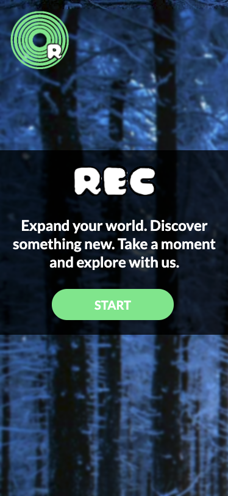
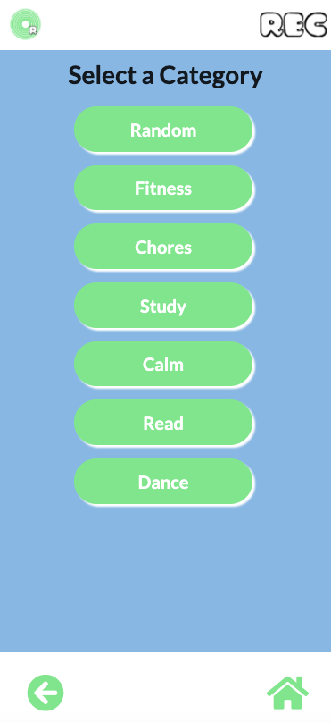
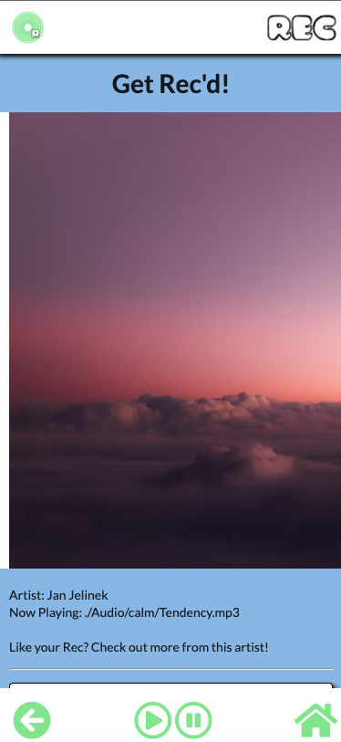

# REC

## What is REC?

Find yourself getting tired of the monotony of both your daily life and your music?

‘Rec’ is:

- simple
- an easy-to-use app
- built to make daily tasks more enjoyable
- helps you discover new music!

With the click of a button, receive a series of images based on your selection, and a whole array of music recommendations! While you sift through the crates, a popular song by a recommended artist will play to set the mood.

## Description

'Rec' requests information from two different server-side APIs, Unsplash and TheAudioMusicDB.

The application has six built-in categories, and a random option for when the user is feeling adventurous! Each category will return a slideshow of images, provide a suggestion of music and play a song, all to put the user in the right mood for the user’s activity of choice.

## Table of Contents

- [Usage](#usage)
- [Technologies](#technologies)
- [Credits](#credits)
- [License](#license)

## Usage

- From the 'Rec' homepage, simply press `START`
- The categories page will offer 6 options, plus a `Random` option:
    - `Fitness`
    - `Chores`
    - `Study`
    - `Calm`
    - `Read`
    - `Dance`
- Select whichever you'd like.
- Get Rec'd! You will receive your artist recommendation, along with their discography, a song by the artist, and some relevant visual media

## Technologies

- HTML
- CSS
- Semantic UI
- JavaScript
- jQuery
- Unsplash API
- TheAudioDB API

## Credits
### Development Team

- **Carolina Rizk**
- **Loreto Delgado III**
- **James Galantino**

## Deployed Application URL

https://jimbopulos.github.io/rec-app/